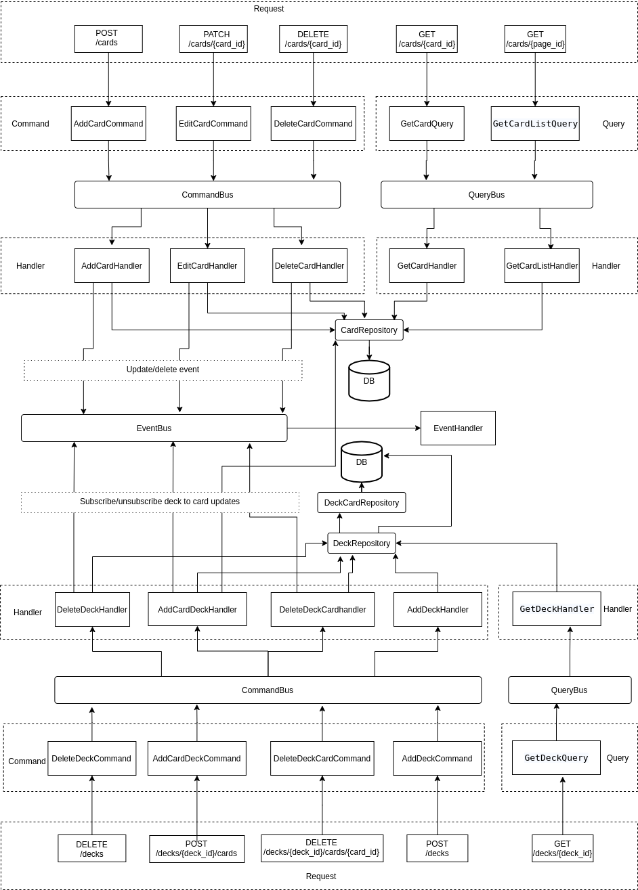

## Arhitercture

Application designed as 2 APIs:
1. Card API allows manipulating card adding, updating and deleting with persisting it to database. Also possible to see list ot cards in catalog.
2. Deck API allows creating deck, add one or more card there, delete one/any cards or full card.
   It has separate (from card) database that allows to scale both of databases separately.
   Table decs_cards store all necessary information the card in deck. It leads to inconsistency (if real card will be deleted or updated) but it resolved by events emitting on card changing or deleting.
   When the card is added to deck it subscribes to this card in catalog updates. If it will be deleted ot modified in catalog the appropriate event will be sent to deck.
   When card deleted from deck it unsubsribe from getting it updates from catalog. Instead of event bus mush better to use Redis or RMQ for ex.
   More over with deck information also send request to get real card data. For simplicity this project allows deck to reuse card repository.

CQRS separates reads and writes into different models, using commands to update data, and queries to read data.
Commands placed on a queue for asynchronous processing, queries process synchronously, they don't modify the database.
All domain models changes emit the persistable event. Each event represents a set of changes to the data.
The current state is constructed by replaying the events.

Exceptions are handled by ApiExceptionSubscriber which is subscribed to kernel.exception event.
Due to the asynchronous way of processing commands, exceptions thrown during their processing are available only in logs or in consume messages.
